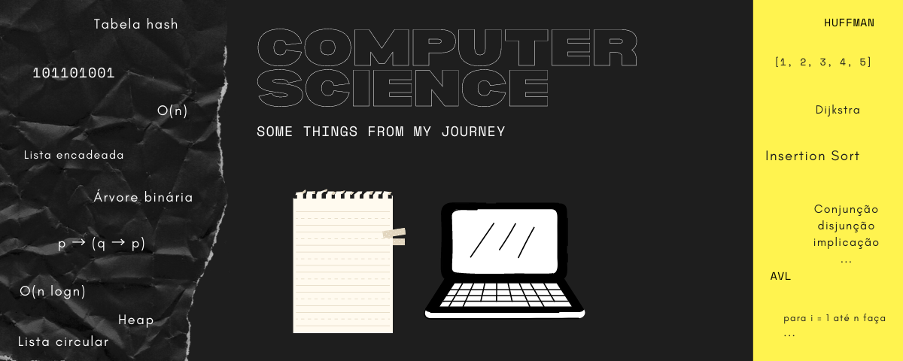

# computer-science
Some things from my journey

- Student: Paulo Henrique Diniz de Lima Alencar.
- Federal University of Ceara - Campuses Russas.

### The Repository
This repository will serve as an academic journal. I will use it to put some files and codes created during my graduation in Computer Science.

Obviously several files were lost or deleted during this journey and unfortunately will not be present in the repository.

## Semesters

| Semester            |  Link de acesso     |
| ------------------- | ------------------- |
|    First semester   |  [acesse](https://google.com.br) |
|   Second semester   |  [acesse](https://google.com.br) |
|   Third semester    |  [acesse](https://google.com.br) |
|   Fourth semester   |  [acesse](https://google.com.br) |
|   Fifth semester    |  [acesse](https://google.com.br) |
|   Sixth semester    |  [acesse](https://google.com.br) |
|   Seventh semester  |  [acesse](https://google.com.br) |
|   Eight semester    |  [acesse](https://google.com.br) |

## Author
Paulo Henrique Diniz de Lima Alencar.

## License

MIT
